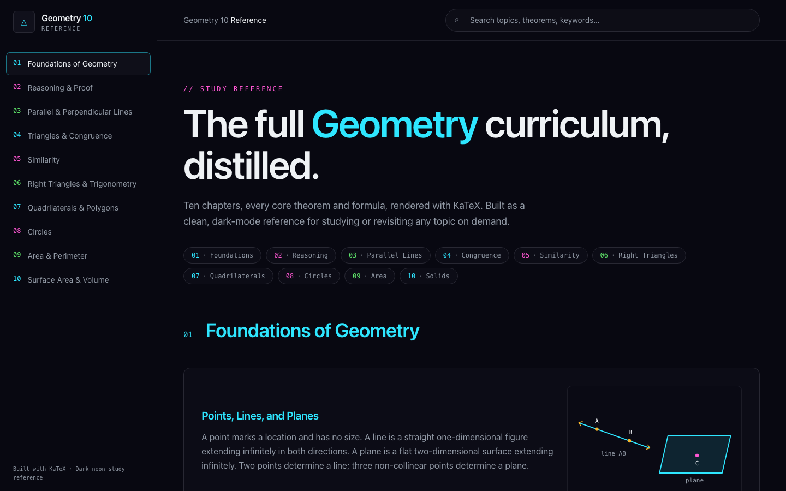
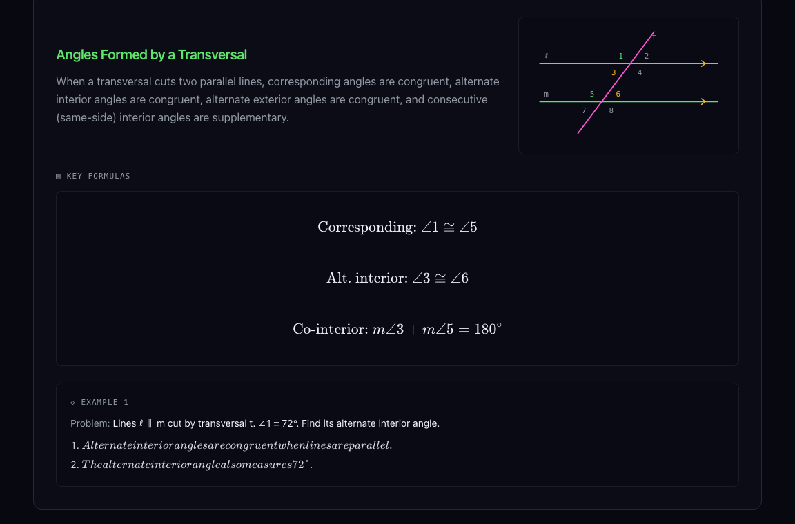
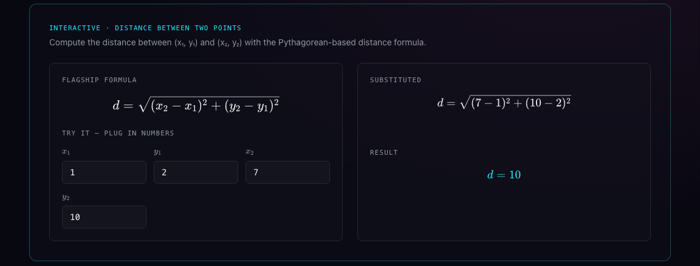

# Geometry Reference

> 영어권 교과과정(10학년 Geometry)을 위한 깔끔한 다크 테마 학습 레퍼런스
> A clean, dark-themed study reference for English-language 10th-grade Geometry.

**🔗 Live site: [geometrylearning.vercel.app](https://geometrylearning.vercel.app)**

---

## 소개 · About

Geometry를 공부하다 보면 "그 정리가 뭐였더라?"를 찾느라 교과서와 검색창을 오가게 됩니다. 이 프로젝트는 그 시간을 줄이기 위해 만들었습니다. 10개 챕터, 37개 개념을 **개념 설명 → 핵심 공식·정리 → 풀이 예제**의 일관된 구조로 정리하고, 직접 값을 넣어 확인할 수 있는 인터랙티브 계산기를 붙였습니다.

Studying Geometry often means flipping between a textbook and a search bar just to recall one theorem. This project puts everything in one place: **10 chapters, 37 concepts**, each with a plain explanation, the key formulas and theorems, and step-by-step worked examples, plus small interactive calculators.

## 주요 기능 · Features

- **KaTeX 수식 렌더링**: 모든 공식이 교과서처럼 선명하게 표시됩니다.
- **실시간 검색**: 주제, 정리, 키워드로 즉시 필터링합니다.
- **풀이 예제**: 문제와 단계별 풀이를 함께 제공합니다.
- **도형 그림**: 대부분의 개념에 개념을 설명하는 SVG 도형이 함께 표시됩니다.
- **인터랙티브 계산기**: 값을 바꿔 가며 결과를 바로 확인합니다.
- **다크 테마 & 반응형 UI**: 데스크톱과 모바일 모두에서 읽기 편합니다.

## 스크린샷 · Screenshots



| 도형 그림 · Diagrams | 인터랙티브 · Interactive |
|---|---|
|  |  |

## 커리큘럼 · Curriculum

| # | Chapter |
|---|---|
| 1 | Foundations of Geometry |
| 2 | Reasoning & Proof |
| 3 | Parallel & Perpendicular Lines |
| 4 | Triangles & Congruence |
| 5 | Similarity |
| 6 | Right Triangles & Trigonometry |
| 7 | Quadrilaterals & Polygons |
| 8 | Circles |
| 9 | Area & Perimeter |
| 10 | Surface Area & Volume |

**인터랙티브 · Interactives**: Distance Between Two Points · Triangle Angle Sum · Perpendicular Slope · SAS Congruence Check · Similarity Scale Factor · Right-Triangle Trig · Polygon Angle Sum · Point-on-Circle Checker · Sector Area · Sphere Volume & Surface Area

## 기술 스택 · Tech Stack

[TanStack Start](https://tanstack.com/start) · [React](https://react.dev) · TypeScript · [Tailwind CSS](https://tailwindcss.com) · [shadcn/ui](https://ui.shadcn.com) · [KaTeX](https://katex.org) · [Vite](https://vitejs.dev)

## 시작하기 · Getting Started

Node.js 18 이상이 필요합니다.

```bash
git clone https://github.com/jin-codes/Geometry_Learning.git
cd Geometry_Learning
npm install
npm run dev
```

| 명령 | 설명 |
|---|---|
| `npm run dev` | 개발 서버 |
| `npm run build` | 프로덕션 빌드 |
| `npm run preview` | 빌드 결과 미리보기 |
| `npm run lint` | ESLint 검사 |
| `npm run format` | Prettier 포맷 |

## 프로젝트 구조 · Project Structure

```
src/
├── data/
│   └── chapters.ts        # 챕터·개념·공식·예제 (콘텐츠는 여기에!)
├── components/
│   ├── Interactives.tsx   # 인터랙티브 계산기 정의
│   ├── TeX.tsx            # KaTeX 렌더러
│   └── ui/                # shadcn/ui 컴포넌트
└── routes/
    ├── __root.tsx         # 루트 레이아웃·메타 태그
    └── index.tsx          # 메인 페이지 (검색, 사이드바, 챕터 뷰)
```

콘텐츠가 **데이터 파일에 분리**되어 있어서, 화면 코드를 건드리지 않고 내용만 추가·수정할 수 있습니다.

## 기여하기 · Contributing

오타 수정, 풀이 오류 제보, 새 개념·예제 추가 모두 환영합니다.

1. 이 저장소를 Fork 합니다.
2. 브랜치를 만듭니다. `git checkout -b fix/triangle-example`
3. `src/data/chapters.ts`의 챕터 `topics`에 개념을 추가하려면 아래 형식을 따릅니다.

   ```ts
   {
     title: "Concept Title",
     body: "Short, plain-language explanation.",
     formulas: ["a^2 + b^2 = c^2"],               // KaTeX 문법
     examples: [{ problem: "…", steps: ["…", "…"] }],
   }
   ```

4. `npm run lint && npm run build`가 통과하는지 확인합니다.
5. Pull Request를 보냅니다.

수학 내용의 오류를 발견했다면 [Issue](https://github.com/jin-codes/Geometry_Learning/issues)로 알려주세요. 어떤 챕터의 어떤 부분인지 적어주시면 큰 도움이 됩니다.

## 배포 · Deployment

Vercel에 GitHub 저장소를 연결해 배포합니다. Vercel 빌드 환경에서는 nitro가 자동으로 `vercel` preset을 선택하므로 별도 설정이 필요 없습니다. `main`에 push하면 자동으로 재배포됩니다.

## 라이선스 · License

[MIT](LICENSE) © 2026 jin-codes
